# Markdown

## 标题

```md
# 一级标题
## 二级标题
### 三级标题
#### 四级标题
##### 五级标题
###### 六级标题
```

## 段落

段落的换行是使用**两个空格**或者加上**回车**

## 字体

*斜体文本*  
**粗体文本**  
***粗斜体文本***

```md
*斜体文本*
_斜体文本_  <!-- 不建议 -->

**粗体文本**
__粗体文本__    <!-- 不建议 -->

***粗斜体文本***
___粗斜体文本___    <!-- 不建议 -->
```

## 分隔线

***

```md
***
```

不建议

```md
* * *   

*****

- - -

----------
```

## 删除线

ABC.COM  
~~ABC.COM~~

```md
ABC@123.COM
~~ABC@123.COM~~
```

## 脚注

[^要注明的文本]

```md
[^要注明的文本]
```

## 列表

### 无序列表

* 第一项
* 第二项
* 第三项

```md
* 第一项
* 第二项
* 第三项

```

不建议

```md
+ 第一项
+ 第二项
+ 第三项


- 第一项
- 第二项
- 第三项
```

### 有序列表

1. 第一项
2. 第二项
3. 第三项

```md
1. 第一项
2. 第二项
3. 第三项
```

### 列表嵌套

1. 第一项：
    * 第一项嵌套的第一个元素
    * 第一项嵌套的第二个元素
2. 第二项：
    * 第二项嵌套的第一个元素
    * 第二项嵌套的第二个元素

```md

1. 第一项：
    * 第一项嵌套的第一个元素
    * 第一项嵌套的第二个元素
2. 第二项：
    * 第二项嵌套的第一个元素
    * 第二项嵌套的第二个元素
```

## 区块

> 死鱼正口
> 收杆就走
> 道袍一换
> 下河开干

```md
> 死鱼正口
> 收杆就走
> 道袍一换
> 下河开干
```

> 最外层
> > 第一层嵌套
> > > 第二层嵌套
> > >
> > > 1. 第一项
> > > 2. 第二项
> > >
> > > * 第一项
> > > * 第二项
> >
> 大气层

```md
> 最外层
> > 第一层嵌套
> > > 第二层嵌套
> > >
> > > 1. 第一项
> > > 2. 第二项
> > >
> > > * 第一项
> > > * 第二项
> >
> 大气层
```

## 代码

````md
```php
$stu = new Stu();
```
````

```php
$stu = new Stu();
```

敲击```abc```键

```md
敲击```abc```键
```

## 链接

[链接名称](github.com) 或者 <https://github.com/>

```md
[链接名称](github.com)或者<链接地址>
```

这个链接用 1 作为网址变量 [github][1]

这个链接用 runoob 作为网址变量 [Runoob][runoob]

然后在文档的结尾为变量赋值（网址）

  [1]: http://www.github.com/
  [runoob]: http://www.runoob.com/

```md
这个链接用 1 作为网址变量 [github][1]

这个链接用 runoob 作为网址变量 [Runoob][runoob]

然后在文档的结尾为变量赋值（网址）

  [1]: http://www.github.com/
  [runoob]: http://www.runoob.com/
```

## 图片


```md


```

## 表格

| 左对齐 | 左对齐 | 居中对齐 | 右对齐 |
| :-----| ---- | :----: | ----: |
| 格 | 格 | 格 | 格 |

```md
| 左对齐 | 左对齐 | 居中对齐 | 右对齐 |
| :-----| ---- | :----: | ----: |
| 格 | 格 | 格 | 格 |

表头   | 表头
----  | ----
格  | 格
```

## 转义

**加粗**  
\*\* 不加粗 \*\*

```md
**加粗**  
\*\* 不加粗 \*\*
```

代码块套代码块

`````md
````md
```md
**加粗**  
\*\* 不加粗 \*\*
```
````
`````

Markdown 支持以下这些符号前面加上反斜杠来帮助插入普通的符号：

```md
\   反斜线
`   反引号
*   星号
_   下划线
{}  花括号
[]  方括号
()  小括号
#   井字号
+   加号
-   减号
.   英文句点
!   感叹号
```

## 内联html元素

插件作者的意图是为了使 markdown 文件是纯 markdown 的，避免在使用 html 以外的方式渲染时出错。
> [MD033/no-inline-html: Inline HTML [Element: kbd]markdownlintMD033](https://github.com/DavidAnson/markdownlint/blob/v0.25.1/doc/Rules.md#md033)

```html
使用 <kbd>Ctrl</kbd>+<kbd>Alt</kbd>+<kbd>Del</kbd> 重启电脑

<u>带下划线文本</u>

上标
a<sup>2</sup> + b<sup>2</sup> = c<sup>2</sup>
Windows 10 <sup>TM</sup>
```

## 复选框

* [ ] Java
* [x] Php

```md
* [ ] Java
* [x] Php
```

## 注释

<!-- 这是一段被注释掉的文字 -->

```md
<!-- 这是一段被注释掉的文字 -->
```

## 数学表达式

$f(x)=a^2+b$

```md
$f(x)=a^2+b$
```

$$
\begin{Bmatrix}
   a & b \\
   c & d
\end{Bmatrix}
$$

```md
$$
\begin{Bmatrix}
   a & b \\
   c & d
\end{Bmatrix}
$$
```

加法符号：$x+y=z$  
减法符号：$x-y=z$  
加减符号：$x pm y=z$  
减加符号：$x mp y=z$  
叉乘符号：$x times y=z$  
点乘符号：$x cdot y=z$  
星乘符号：$x ast y=z$  
除法符号：$x div y=z$  
斜除符号：$x/y=z$  
分式1：$frac{x+y}{y+z}$   
分式2：${x+y} over {y+z}$  
绝对值：$|x+y|$  

## 绘制图形

### 流程图

标志|方向
---|---
TB|top bottom - 从上到下
BT|bottom top - 从下到上
RL|right left - 从右到左
LR|left right - 从左到右
TD|等同于 TB

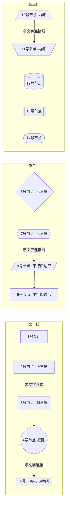

````md

````

#### 横向流程图

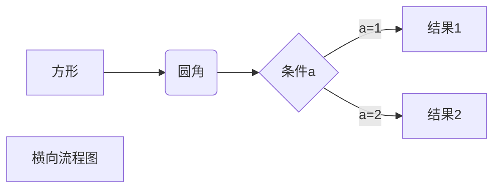

````md

````

#### 竖向流程图

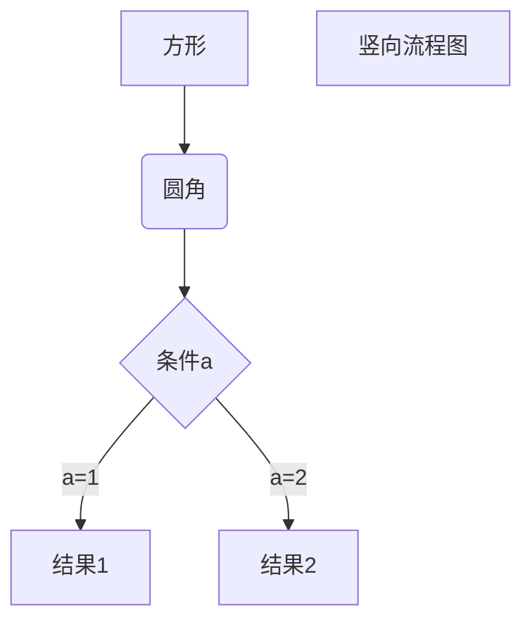

````md

````

### 时序图 sequence diagram

角色(Actor)、对象(Object)、生命线(LifeLine)、控制焦点(Activation)、消息(Message)、自关联消息、组合片段

类型|描述
---|---
`->`|直线
`-->`| 虚线
`->>`|有箭头的实线
`-->>`|有箭头的虚线

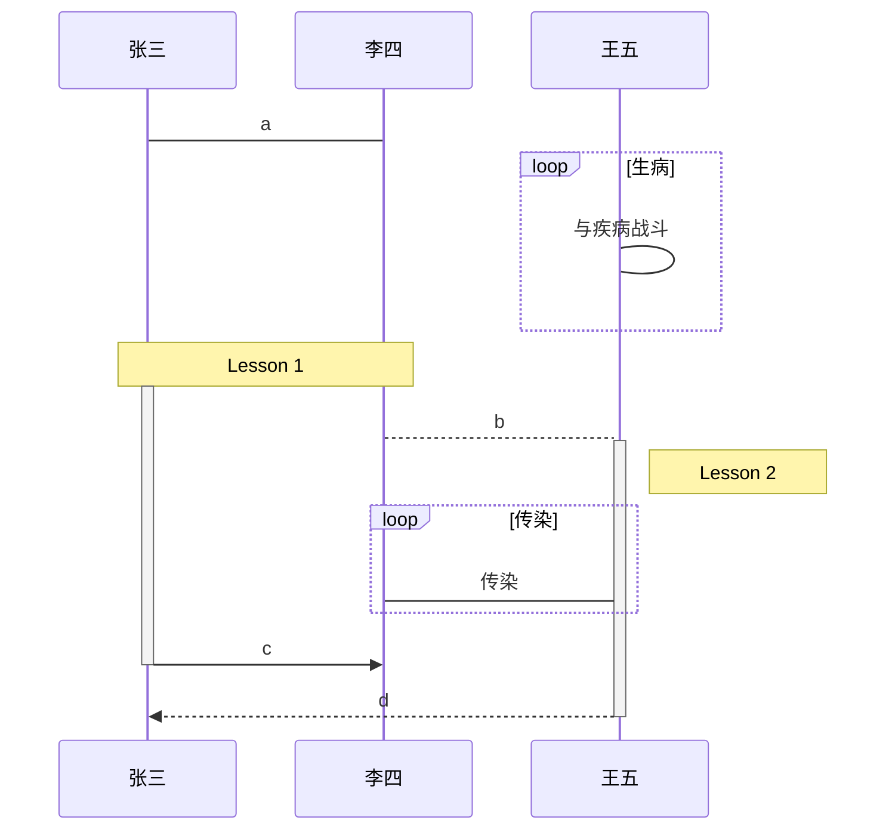

#### 聚焦


````md
​```mermaid
sequenceDiagram
    李雷->>韩梅梅: Hello, what's your name?
    activate 韩梅梅
    韩梅梅-->>李雷: Hello, my name is Hanmeimei!
    deactivate 韩梅梅
​```

简写
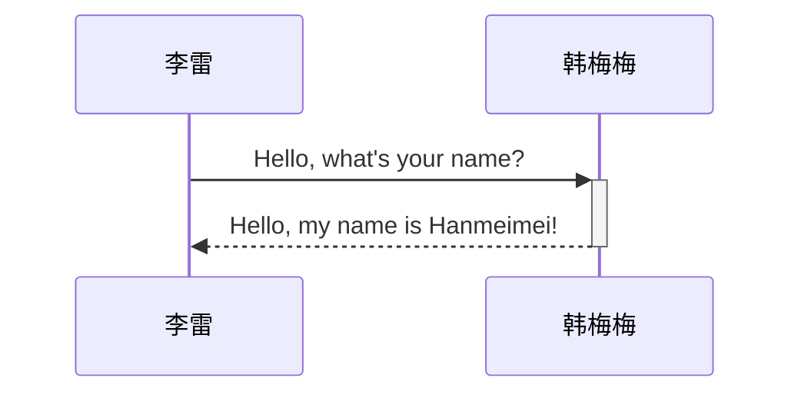
````

#### 备注

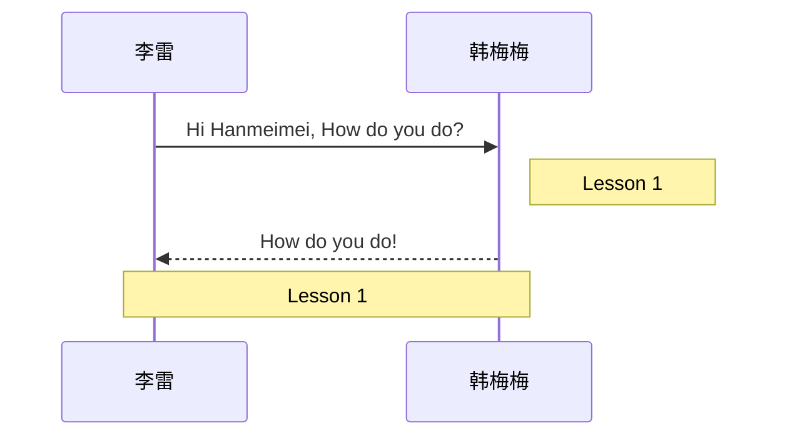

````md

````

#### 逻辑

片段关型|名称|说明
---|---|---
Opt|选项|包含一个可能发生或可能不发生的序列。可以在临界中指定序列发生的条件。
Alt|抉择|包含一个片段列表，这些片段包含备选消息序列。在任何场合下只发生一个序列。可以在每个片段中设置一个临界来指示该片段可以运行的条件。else 的临界指示其他任何临界都不为 True 时应运行的片段。如果所有临界都为 False 并且没有 else，则不执行任何片段。
Loop|循环|片段重复一定次数。可以在临界中指示片段重复的条件。Loop 组合片段具有“Min”和“Max”厦性，已们指示片段可以重复的最小和最大次数-默认值是无限制。
Break|中断|如果为行此片段，则放弃序列的其余部分，可以使用临界来指示发生中断的条件。
Par|并行|并行处理，片段中的事件可以交错.
Critical|关键|用在 Par 或 Seq 片段中。指示此片段中的消息不得与其他消息交错。
Seq|弱顺序|有两个或更多操作数片段．涉及同一生命线的消息心须以片段的顺序发生。如果消息涉及的生命线不同，来自不同片段的消息可能会并行交措。
Strict|强顺序|有两个或重多操作数片段，这些片段心须投给定顺序发生：

##### 循环 Loop

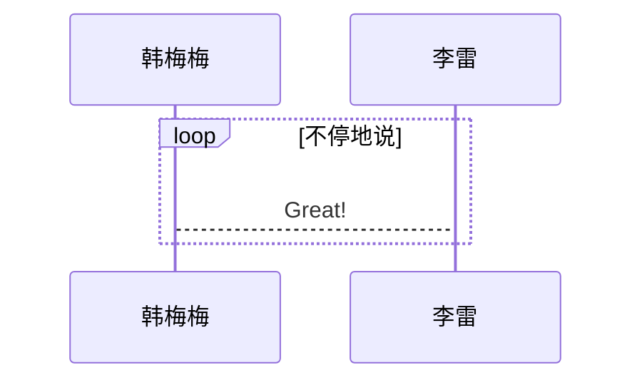

````md

````

##### 抉择 Alt

### 类图 Class diagrams

* 类名称，在类图的最顶端；
* 类属性，在类图的中间层；
* 类方法，在类图的最下层。

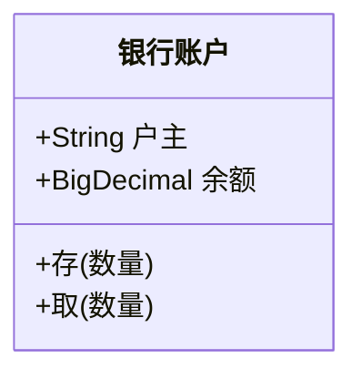

````md
classDiagram
  class 银行账户
  银行账户 : +String 户主
  银行账户 : +BigDecimal 余额
  银行账户 : +存(数量)
  银行账户 : +取(数量)
````

### 状态图 Statechart

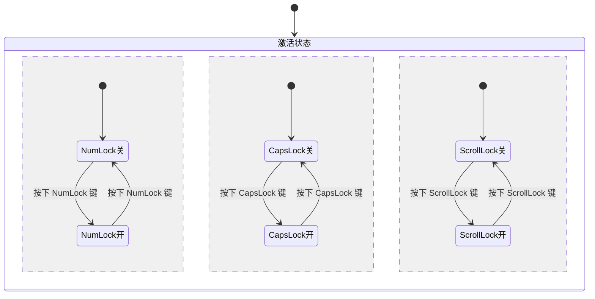

### 甘特图 Gantt chart

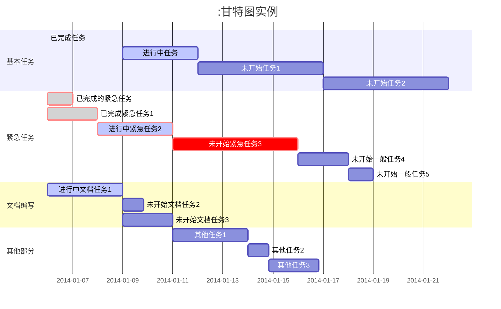

````md

````

### 饼图 Pie chart

pie title 宠物的选择
    "狗" : 386
    "猫" : 85
    "兔子" : 15 

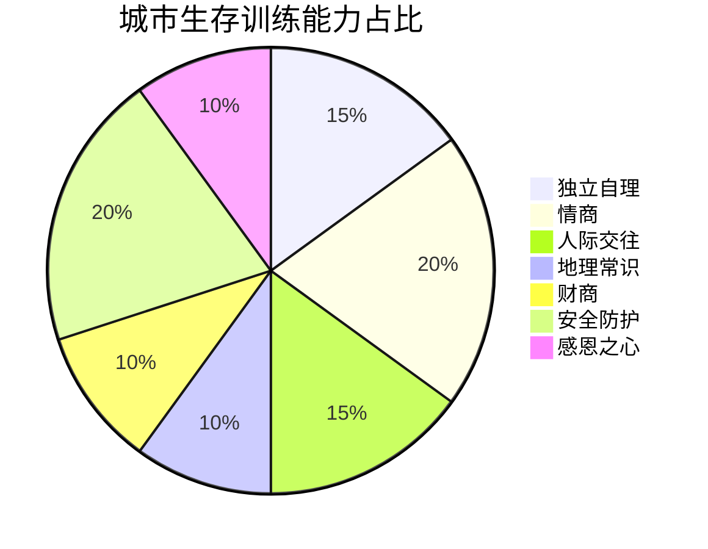
sss