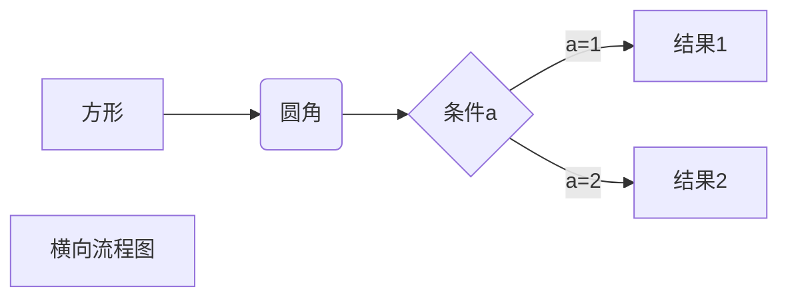

# 简单句

## 基本句型

- 主语＋动词
- 主语＋动词＋宾语
- 主语＋动词＋间接宾语＋直接宾语
- 主语＋动词＋宾语＋宾语补语
- 主语＋动词＋主语补语/表语

什么+怎么样
主语(subject)+谓语(predicate)

谓语有个核心动词叫谓语动词

谓语动词
无需承受者(宾语)：
主语＋不及物动词
一个宾语，无补充信息：
主语＋单及物动词＋宾语
两个宾语：
主语＋双及物动词＋间接宾语＋直接宾语
一个宾语＋补充信息：
主语＋复杂及物动词＋宾语＋(宾语)补语
赋子信息：
主语＋系动词＋ 主语补语/表语

## 句子成分

- 主语
- 谓语动词
- 宾语
- 宾语补语
- 主语补语
- 定语
- 状语
- 同位语

## 复合句/并列句

一个句子套另一个句子

## 词性(词类)

句子成分≠词类

- 动词
- 名词
- 冠词
- 代词
- 形容词
- 数词
- 副词
- 介词
- 叹词
- 连词

